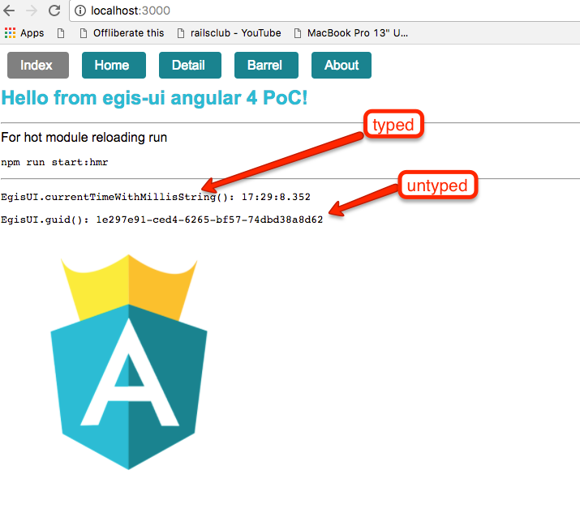

### Quick start
**Make sure you have Node version >= 6.0 and NPM >= 3**

PT logging in is not implemented, so this is set to work in context of existing PT session via build-tools' 
[browsersync](https://github.com/egis/build-tools/blob/master/README.md#browsersync).
  
```bash
# cd to dir where you have build-tools installed
cd /my/path/to/egis/projects

# clone this repo
git clone https://github.com/artemv/egis-ui-angular4poc
# now 'ls' should give you both egis-ui-angular4poc and build-tools, among others
# change directory to our repo
cd egis-ui-angular4poc

# install the repo with npm
yarn

# build
yarn run build

# start browsersync. Here 192.168.99.10 is IP your Docker PT is served from.
npm run browsersync -- --proxied-host=192.168.99.100

# open browsersync'ed PT and log in there: http://0.0.0.0:3001/
# open the demo at http://0.0.0.0:3001/web/angular-poc/
```



### Caveats
EgisUI's dev mode is not supported. You can link it into this project to use latest changes but you need to build it to 
apply them.
___

Based on [Angular 4 Starter](https://gith``ub.com/AngularClass/angular-starter) boilerplate.